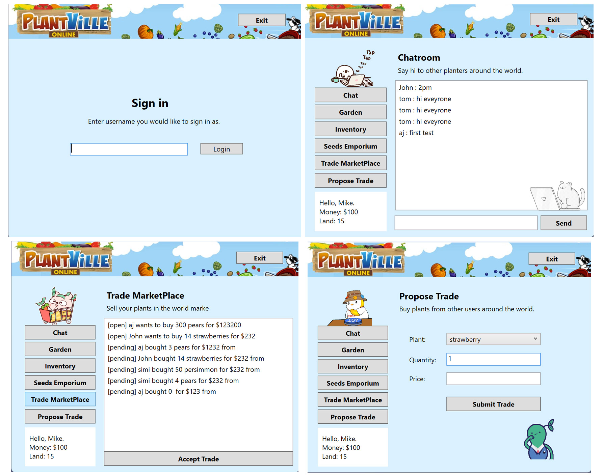

# PlantVille Online
A C# App inspired by the FarmVille game.

## Copyright Disclaimer / Student Warning
_I developed this project for the C# II course part of the UCLA Applications Certificate._

_If you're a student currently enrolled to this course feel free to review my code **but only for study purposes.**_

***DO NOT hand it in as yours***, _professor has all the records of each one of our previous delivered works, so he will know it and you'll undoubtedly get in trouble for plagiarism._

## Description ##
We'll play as a farmer who buys seeds, waits for them to harvest, then reap the rewards! 

## Screenshots


## Details/Notes

1. If the server hasn't been hit in a while, it takes a while to wake up. So be patient on the first load, it may take 30 seconds or so.
2. Plantville Online builds on the last Plantville project. Once you turn in your Plantville project, you have the option of using your previous Plantvillle code or mine.
3. For the fianl project, please expand and integrate APIs into Plantville WPF. More info on API below.

We are going to turn Plantville into an online game. [Give it a shot](./MGPlantVilleOnline/app/MGPlantVilleOnline.exe) to see how it works. 

## New Features
1. When you are in a textbox, you should be able to press Enter and the submit button should automatically execute. This should happen in most textboxes.
2. Sign-in page:
    - Players open the app to a sign-in page. Players can sign in as whatever name they want. This will be their username whenever they post a chat message or submit a trade.

3. Inventory
    - Update page so instead of listing every plant you have, list them by unique plants and the quantity owned. If there are 0 plants (e.g. 0 strawberries), it should be removed from the list. Pattern of {seed name}[{quantity}]{seed price} (e.g. `spinach [1] $5`)
    - Update save to file feature to reflect this update.

4. Chatroom
    - Displays the latest chat messages.
        - Task: Make a GET request to the server. More info on API below.
    - Players can post new chat messages. 
        - Task: Make a POST request to server. More info on API below.
    - This chatroom only updates when you first enter the chatroom or after submitting a new message. This won't auto-update (to make it simpler for you). This means you have to click the "Chat" button on the left hand side to get new updates.

5. Propose trade
    - Propose a trade that appears on the Marketplace. Once completed, it should clear the fields and show confirmation message.
        - Task: Make a POST request to server.
    - Plant ComboBox is populated from seed_list variable (the list of seeds we can buy).

        > Side note: Good developers see this as an obvious implementation. We want our data to expand and contract from one source (e.g. seed_list). 
    - Validation: 
        - Verify player has enough money to propose trade.

6. Trade Marketplace
    - On first load, displays latest trades.
        - Task: Make GET request to server
        - Each trade has a unique ID.  That ID is called "pk", which stands for Primary Key. This is the ID of the trade we will be using when we ask for it.
    - Player selects a trade from ListBox, then accepts it. 
    - Accepting trades: There are two parties to a trade -- the `author` and the `receiver`. 

    - Validation:
        - Verify player selected a trade before clicking accept button.
        - Verify player did not accept a trade they proposed. Can only accept trades from other players.
        - Verify player did not accept a closed trade. Can only accept open trades.
        - Verify player has enough resources to accept trade. If trade requests 3 strawberries, player must have at least 3 strawberries in their inventory.

7. Author proposed the trade.
    - Receiver accepted the trade conditions.
    - When author proposes a trade:
        - It appears immediately on the trade marketplace.
        - This part is weird. Ask questions if confusing.

        > Inventory and money exchange does not occur immediately. Author must wait until a person on the marketplace accepts the trade. The first time an author returns to Marketplace after their trade has been accepted, the inventory and money exchange will adjust.

    - When receiver accepts a trade:
        - Send message box showing trade has been accepted.
        - Adjust inventory and money exchange immediately.
        - Close the trade.
            - Task: Make POST request to server.


## APIs
Below is an explanation of the URLs, the http methods (e.g. POST or GET), and the variables we need to pass to the server. Please refer to [Api collection of Insomnia](/final//common//Insomnia_2023-06-03.json) and start point with testing Api.

1. Chat messages - https://plantville.herokuapp.com/
    - GET retrieves last 100 chat messages in JSON.
    ```shell
    curl --request GET \
    --url https://plantville.herokuapp.com/ \
    --header 'Content-Type: application/json'
    ```
    - POST adds a new chat message.
        - Returns last 100 chat messages after adding new chat message.
        - `username`: the name of player sending chat message
        - `message`: chat message
    ```shell
    curl --request POST \
    --url https://plantville.herokuapp.com/ \
    --header 'Content-Type: application/x-www-form-urlencoded' \
    --data username=user1 \
    --data message=message1
    ```
2. Trades - https://plantville.herokuapp.com/trades
    - GET retrieves last 100 trade proposals
    
    ```shell
    curl --request GET \
    --url https://plantville.herokuapp.com/trades \
    --header 'Content-Type: application/json'
    ```
    - POST adds a new trade proposal.
        - Returns the ID of the new trade. This is useful for tracking which trades are pending for authors waiting for their trade to be accepted.
        - `author`: name of player sending trade proposal
        - `plant`: name of plant player wants to buy
        - `quantity`: amount of plan they want (e.g. 3 strawberries)
        - `price`: price player willing to pay
    
    ```shell
    curl --request POST \
    --url http://plantville.herokuapp.com/trades \
    --header 'Content-Type: application/x-www-form-urlencoded' \
    --data 'author=user1' \
    --data plant=pears \
    --data quantity=10 \
    --data price=10
    ```
3. Accept trade - https://plantville.herokuapp.com/accept_trade
    - POST accepts the trade
        - `trade_id`: The ID given when adding a new trade proposal
        - `accepted_by`: the name of player accepting trade proposal
    ```shell
    curl --request POST \
    --url https://plantville.herokuapp.com/accept_trade \
    --header 'Content-Type: application/x-www-form-urlencoded' \
    --data trade_id=11 \
    --data 'accepted_by=user2'
    ```
